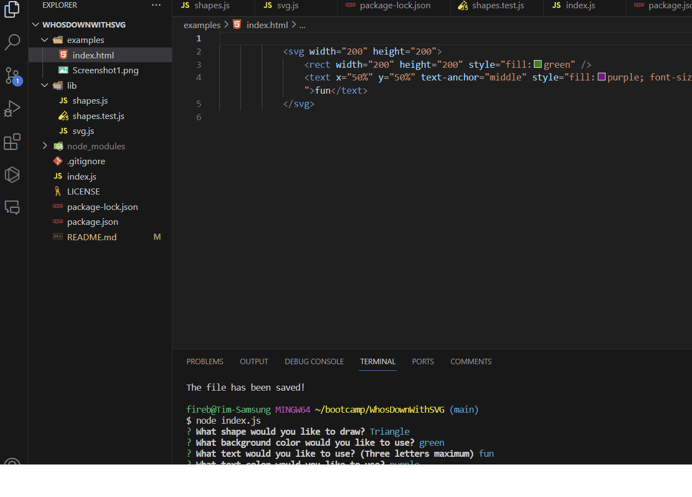

# WhosDownWithSVG


## Description


This command-line application allows you to generate an SVG logo by providing input for the following prompts:

- Text (up to three characters)
- Text color (color keyword or hexadecimal number)
- Shape (circle, triangle, or square)
- Shape color (color keyword or hexadecimal number)

Once you have provided input for all of the prompts, an SVG file named `logo.svg` will be created and the output text "Generated logo.svg" will be printed in the command line.

**To use the application:**

1. Open a terminal window and navigate to the directory where the application is installed.
2. Run the following command:

`node index.js`

3. Follow the prompts to enter your desired text, text color, shape, and shape color.
4. Once you have entered input for all of the prompts, press `Enter`.

The SVG file will be created and the output text will be printed in the command line.

**To open the SVG file:**

1. Open a web browser and navigate to the directory where the SVG file is located.
2. Double-click on the SVG file to open it in the browser.

You should see a 300x200 pixel image that matches the criteria you entered.

**Example:**

```
$ node index.js

What shape would you like to draw? (circle, triangle, or square): circle
What background color would you like to use? (color keyword or hexadecimal number): red
What text would you like to use? (Three letters max): cat
What text color would you like to use? purple

Generated logo.svg
```

Opening the `logo.svg` file in a browser will show a 300x200 pixel image of a purple cat on a red background.


## Screenshot




## Links

- [GitHub Repository](https://github.com/Flagg217/WhosDownWithSVG.git) 

- [Video Walkthrough](https://drive.google.com/file/d/1kogrn_msR7Op_Hq9MPzIomzn9bPYGec7/view)